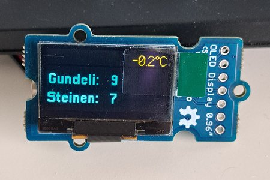
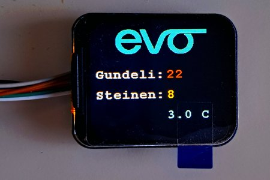

# EvoFitness Gym Attendance Display

Real-time gym occupancy monitor for EvoFitness Basel clubs. Displays current attendance numbers for Gundeli and Steinen locations plus local temperature on compact displays.


## Overview

A personal project to create a dedicated desk display showing real-time gym attendance, eliminating the need to check https://visits.evofitness.ch/ repeatedly. Perfect for planning your gym visits to avoid crowds!

**Features:**
- 📈 Real-time occupancy data for 2 gym locations (Gundeli & Steinen)
- 🌡️ Current apparent temperature for Basel
- 🎨 Color-coded occupancy levels (on LCD version)
- ⚡ Optimized refresh strategies for each display type
- 🔄 Auto-reconnect on WiFi loss
- 💾 Update only when values change (saves power and screen wear)

## Hardware Versions

This project supports **three different display options** - choose based on your preference and availability:

| Version | Display Type | Resolution | Best For | Refresh Rate |
|---------|-------------|------------|----------|--------------|
| **[OLED](#oled-version)** | 0.96" SSD1306 | 128x64 mono | Compact, low power | 60 seconds |
| **[ST7789V2](#st7789v2-lcd-version)** | 1.69" LCD | 240x280 color | Colorful, logo support | 180 seconds |
| **[ePaper](#epaper-version)** | 2.13" E-Ink | 250x122 mono | Ultra-low power, readable | 60 seconds |

All versions use the same microcontroller: **XIAO ESP32C3**

## Photos

**OLED:**<br> 


**ST7789V2:**<br>



## Hardware Requirements

### Common Components (All Versions)

| Component | Purpose |
|-----------|---------|
| **XIAO ESP32C3** | Microcontroller with WiFi |
| **USB-C Cable** | Power & programming |
| **WiFi Network** | 2.4GHz access required |

### Display Options

#### OLED Version
- **Display:** 0.96" SSD1306 OLED (128x64 pixels)
- **Interface:** I2C
- **Pros:** Compact, crisp text, low power
- **Cons:** Blue/Yellow only, smaller screen
- **Link:** https://www.seeedstudio.com/Grove-OLED-Yellow-Blue-Display-0-96-SSD1315-V1-0-p-5010.html
- **Groove connector adapter (optional, recommended):** https://www.seeedstudio.com/Grove-Shield-for-Seeeduino-XIAO-p-4621.html?qid=NMVHO5_czjgv2bd_1769697054111

#### ST7789V2 LCD Version
- **Display:** 1.69" ST7789V2 LCD (240x280 pixels)
- **Interface:** SPI
- **Pros:** Full color, logo display, larger
- **Cons:** Higher power consumption
- **Link:** https://www.seeedstudio.com/1-69inch-240-280-Resolution-IPS-LCD-Display-Module-p-5755.html

#### ePaper Version
- **Display:** 2.13" E-Ink (250x122 pixels)
- **Compatible:** Seeed Studio XIAO expansion board with e-paper
- **Interface:** SPI
- **Pros:** Lowest power, readable in sunlight, no screen burn-in
- **Cons:** Slower refresh, monochrome
- **Link epaper display:** https://www.seeedstudio.com/2-13-Monochrome-ePaper-Display-with-122x250-Pixels-p-5778.html
- **Link adapter board:** https://www.seeedstudio.com/ePaper-Breakout-Board-p-5804.html

## Wiring Connections

### OLED Version (I2C)
```
SSD1306 Display → XIAO ESP32C3
--------------------------------
VCC  → 3.3V
GND  → GND
SCL  → D5 (SCL)
SDA  → D4 (SDA)
```

### ST7789V2 LCD Version (SPI)
```
ST7789V2 Display → XIAO ESP32C3
---------------------------------
VCC  → 3.3V
GND  → GND
SCL  → D8 (SCK)
SDA  → D10 (MOSI)
RES  → D3 (Reset)
DC   → D4 (Data/Command)
CS   → D5 (Chip Select)
BL   → D6 (Backlight)
```

### ePaper Version (SPI)
```
E-Paper Display → XIAO ESP32C3
--------------------------------
Uses Seeed Studio XIAO ePaper expansion board
(connects directly to XIAO headers)

Pin assignments:
BUSY → D5
RST  → D0
DC   → D3
CS   → D1
SCK  → D8
MOSI → D10
```

## Software Requirements

### Arduino IDE Setup

1. **Install Arduino IDE** (version 1.8.x or 2.x)

2. **Add ESP32 Board Support:**
   - Go to `File` → `Preferences`
   - Add to "Additional Board Manager URLs":
     ```
     https://raw.githubusercontent.com/espressif/arduino-esp32/gh-pages/package_esp32_index.json
     ```
   - Go to `Tools` → `Board` → `Boards Manager`
   - Search for "esp32" and install "esp32 by Espressif Systems"
   - Select `Tools` → `Board` → `XIAO_ESP32C3`

### Required Libraries

Install via Arduino Library Manager (`Sketch` → `Include Library` → `Manage Libraries`):

**For OLED Version:**
- `U8g2` - Display driver for SSD1306
- `ArduinoJson` (v6 or v7) - JSON parsing
- `WiFi` & `HTTPClient` (built-in with ESP32)

**For ST7789V2 LCD Version:**
- `st7789v2` - Display driver for ST7789V2
- `ArduinoJson` (v6 or v7) - JSON parsing
- `WiFi` & `HTTPClient` (built-in with ESP32)

**For ePaper Version:**
- `GxEPD2` - E-Paper display driver
- `Adafruit GFX` - Graphics library (dependency)
- `ArduinoJson` (v6 or v7) - JSON parsing
- `WiFi` & `HTTPClient` (built-in with ESP32)

## Installation & Setup

### 1. Clone or Download This Repository

```bash
git clone https://github.com/53RG10/evofitness-gym-attendance-display.git
cd evofitness-gym-attendance-display
```

### 2. Choose Your Display Version

Navigate to the folder for your display type:
- `OLED/` - For OLED display
- `ST7789V2/` - For LCD display
- `ePaper/` - For E-Paper display

### 3. Configure WiFi Credentials

**For OLED and ePaper versions:**
Edit the `.ino` file directly and update lines ~26-28:
```cpp
const char *ssid = "Your_WiFi_Network_Name";
const char *password = "Your_WiFi_Password";
```

**For ST7789V2 version:**
Edit the `secrets.h` file:
```cpp
const char* SECRET_SSID = "Your_WiFi_Network_Name";
const char* SECRET_PASS = "Your_WiFi_Password";
```

### 4. Upload to Your Device

1. Connect your XIAO ESP32C3 via USB-C
2. Open the corresponding `.ino` file in Arduino IDE
3. Select: `Tools` → `Board` → `XIAO_ESP32C3`
4. Select: `Tools` → `Port` → (your device's COM port)
5. Click Upload (→)
6. Monitor via `Tools` → `Serial Monitor` (115200 baud)

### 5. First Boot

On first boot, the device will:
1. Initialize the display
2. Connect to WiFi (10-30 seconds)
3. Fetch gym occupancy and weather data
4. Display the information

Check the Serial Monitor for detailed connection and data fetching logs.

## Display Information

### What's Displayed

```
┌─────────────────────────────┐
│  [Temperature]        °C    │ ← Current apparent temp
│                             │
│  Gundeli:   [count]         │ ← Gundeli occupancy
│  Steinen:   [count]         │ ← Steinen occupancy
└─────────────────────────────┘
```

### Color Coding (ST7789V2 LCD Only)

**Occupancy Colors:**
- 🟢 **Green:** < 5 people (Low)
- 🟡 **Yellow:** 5-9 people (Moderate)
- 🟠 **Orange:** 10-14 people (Busy)
- 🔴 **Red:** ≥ 15 people (Very Busy)

**Temperature Colors:**
- 🔵 **Cyan:** < 10°C (Cold)
- ⚪ **White:** 10-30°C (Comfortable)
- 🔴 **Red:** > 30°C (Hot)

### Update Intervals

- **OLED:** Every 60 seconds
- **LCD:** Every 180 seconds (3 minutes)
- **ePaper:** Every 60 seconds
  - Partial refresh for value updates
  - Full refresh every 10 partial updates

## Data Sources

### EvoFitness API

The project uses the official EvoFitness API to fetch real-time occupancy:

**Gundeli Location:**
```
https://visits.evofitness.ch/api/v1/locations/cc3013fa-9f58-4056-8731-40ed4058663a/current
```

**Steinen Location:**
```
https://visits.evofitness.ch/api/v1/locations/91aa317c-5c31-4083-a05e-a5b0a7583d48/current
```

**API Response Format:**
```json
{
  "current": 12,
  "max": 50,
  "timestamp": "2026-01-29T10:30:00Z"
}
```

### Weather API

Temperature data from **Open-Meteo** (free, no API key required):
```
https://api.open-meteo.com/v1/forecast?latitude=47.5584&longitude=7.5733&current=apparent_temperature&forecast_days=1
```

Coordinates: Basel, Switzerland (47.5584°N, 7.5733°E)

## Technical Details

### Smart Update Strategy

All versions implement intelligent update logic:
1. **Fetch data** from APIs
2. **Compare** with previous values
3. **Update display** only if values changed
4. **Skip refresh** if no changes (saves power and screen wear)

### Display-Specific Optimizations

**OLED:**
- Full screen redraw only when needed
- Uses efficient U8g2 library buffering

**LCD (ST7789V2):**
- Static elements drawn once (logo, labels)
- Dynamic values cleared and redrawn individually
- Prevents full screen flicker

**ePaper:**
- Partial refresh for value updates (fast)
- Full refresh every 10 updates (prevents ghosting)
- Minimal power consumption between refreshes

### WiFi Reliability

All versions include:
- Auto-reconnect on connection loss
- Error display when offline
- Serial logging for debugging

## Troubleshooting

### Display Shows Nothing
- Check power connection (USB-C to XIAO)
- Verify wiring matches your display type
- Check Serial Monitor for initialization errors
- Try adjusting display contrast/backlight in code

### WiFi Connection Fails
- Verify SSID and password in code
- Ensure 2.4GHz WiFi (5GHz not supported)
- Check WiFi signal strength at device location
- Look for connection errors in Serial Monitor

### No Data Displayed / Shows "--"
- Check internet connectivity
- Verify APIs are accessible (test URLs in browser)
- Check Serial Monitor for HTTP errors
- Ensure firewall isn't blocking requests

### OLED Display is Dim
- Increase contrast: `u8g2.setContrast(255);` in setup()

### LCD Colors Don't Look Right
- Check SPI wiring
- Verify power supply is stable (use quality USB cable)

### ePaper Ghosting/Artifacts
- Increase full refresh frequency (reduce counter threshold)
- Ensure proper power supply

### Serial Monitor Tips
- Baud rate: **115200**
- Shows detailed logging for all operations
- Essential for debugging API calls and WiFi issues

## Customization

### Changing Update Intervals

Edit the `delay()` value at the end of `loop()`:

```cpp
// OLED & ePaper: 60 seconds (60000 ms)
delay(60000);

// LCD: 180 seconds (180000 ms)
delay(180000);
```

## Finding Your Gym Location ID

1. Open https://visits.evofitness.ch/ in your browser
2. Open Developer Tools (F12 or right-click → Inspect)
3. Go to the "Network" tab
4. Select your gym from the dropdown
5. Look for API calls to `/api/v1/locations/[ID]/current`
6. Copy the ID (long UUID format like `cc3013fa-9f58-4056-8731-40ed4058663a`)
7. Replace the ID in the code with your gym's ID

### Adding More Gym Locations

1. Find your gym's location ID from https://visits.evofitness.ch/
2. Add a new API URL variable
3. Add HTTP request code in `loop()`
4. Update display logic to show additional location

### Changing Temperature Units

The API provides Celsius. For Fahrenheit conversion:
```cpp
double tempF = (currentTemp * 9.0/5.0) + 32.0;
```

### Adjusting Color Thresholds (LCD)

Edit the `getOccupancyColor()` function in `ST7789V2.ino`:
```cpp
if (value < 5) return GREEN;       // Adjust thresholds
else if (value < 10) return YELLOW;
else if (value < 15) return ORANGE_COLOR;
else return RED;
```


## Use Cases

- 🏋️ **Gym Planning:** Check crowd levels before leaving home
- 📊 **Habit Tracking:** Build awareness of gym patterns
- 🖥️ **Desk Dashboard:** Always-visible gym status on your workspace
- 🔌 **Learning Project:** Hands-on ESP32, displays, and APIs

## Future Ideas

Potential enhancements (not currently planned):
- Historical occupancy tracking and graphs
- Peak hours analysis
- Multiple gym chain support
- Battery power option
- Mobile app companion
- Push notifications for low occupancy

## Contributing

This is a personal project, but contributions are welcome! Feel free to:
- Open issues for bugs or suggestions
- Fork and create pull requests
- Share your own display variations
- Suggest new gym locations or features

## License

This project is licensed under the **MIT License** - see the [LICENSE](LICENSE) file for details.

**If you use this project, attribution would be appreciated!** ⭐

## Acknowledgments

- EvoFitness for providing the public API
- Open-Meteo for free weather data
- Arduino and ESP32 communities
- All the display library maintainers

## Disclaimer

This is an unofficial third-party project and is not affiliated with, endorsed by, or connected to EvoFitness. The gym occupancy data is sourced from publicly available APIs. Use of this project is at your own discretion and risk.

For official gym information, visit https://www.evofitness.ch/

---

**⭐ If you find this project useful, please consider giving it a star on GitHub!**

*Made with ❤️ in Basel for fitness enthusiasts who like to optimize their gym time*
